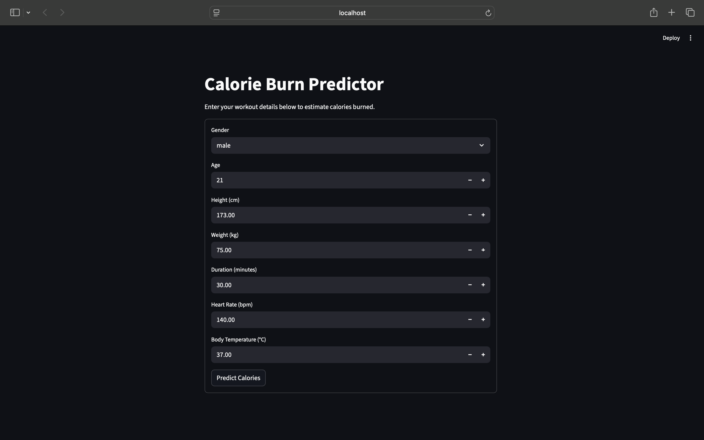

# Calorie Burn Predictor

A production-style machine learning app that predicts calories burned during workouts using physiological and workout features. An end-to-end machine learning app that predicts **calories burned** during a workout using physiological + workout features.

## Demo



## Tech Stack
- Python
- Pandas / NumPy
- Scikit-learn
- FastAPI (model inference API)
- Streamlit (UI)

## Features Used
- Gender, Age, Height, Weight
- Duration, Heart Rate, Body Temp

## Model
Random Forest Regressor

Test performance (holdout split):
- MAE: 1.67
- RMSE: 2.63
- R²: 0.998

## Architecture
Streamlit UI → FastAPI Backend → Trained Model → JSON Response

## How to Run Locally

### 1) Create & activate virtual environment
```bash
python3 -m venv .venv
source .venv/bin/activate
pip install -r requirements.txt